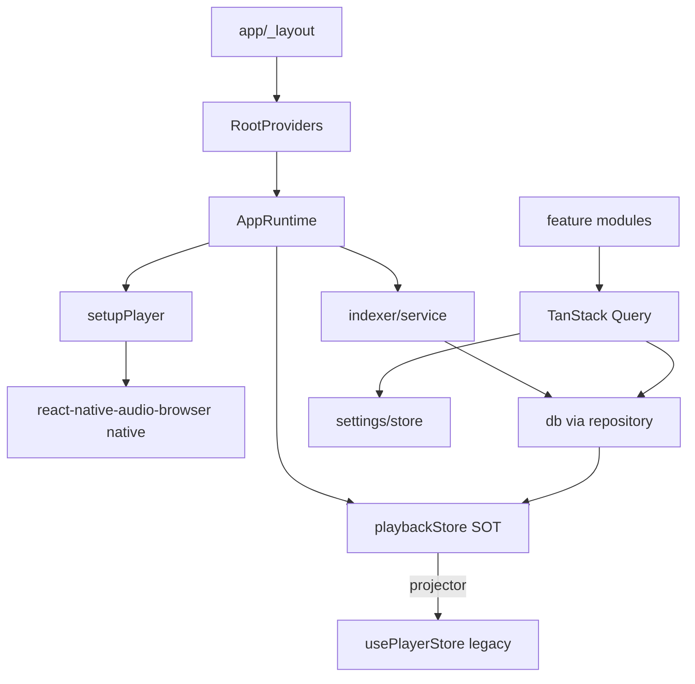

# Refactor Plan: Startune Music

## 1. Audit Scope and Coverage

- **Audit date:** 2026-07-16
- **Repository:** startune-music (Expo Router / React Native 0.86 / React 19 music player)
- **Coverage statement:** Complete. Every non-excluded folder was marked `inspected` or `excluded` with a documented reason. No unreachable folders. 727 files indexed.
- **Folders inspected:** 74 (all non-excluded directories under repo root, recursively including `src`, `modules`, `scripts`, `.github`, `.agents`, configs).
- **Folders excluded:** 4 (`node_modules`, `.git`, `android`, `.expo`) — dependency/build/vendor outputs.
- **Unreachable folders/files:** 0.

### Repository Inventory

| Path | Type | Status | Purpose | Notes |
|---|---|---|---|---|
| `./` | root | inspected | App root, manifest, configs | — |
| `package.json` | config | inspected | Deps, scripts, expo/patches config | 2 native patches pinned; `EXPO_PUBLIC_LASTFM_*` secrets |
| `tsconfig.json` | config | inspected | TS strict, `@/*` path alias | `ignoreDeprecations:6.0`; no project refs |
| `.oxlintrc.json` | config | inspected | Lint (import/no-cycle:error) | No `typecheck` gate |
| `.oxfmtrc.json` | config | inspected | Formatter config | Excludes generated files |
| `vitest.config.ts` | config | inspected | Test runner, node env, `@` alias | `setupFiles` is empty stub |
| `app.config.ts` | config | inspected | Expo config, plugins, permissions | `reactCompiler:true`; intent filters for audio |
| `eas.json` | config | inspected | EAS build profiles | `appVersionSource:remote` |
| `drizzle.config.ts` | config | inspected | Drizzle kit config | — |
| `babel.config.js` | config | inspected | Babel preset | — |
| `metro.config.js` | config | inspected | Metro bundler; polyfills; monicon | top-level `Array.prototype.toReversed` polyfill |
| `monicon.config.ts` | config | inspected | Icon generation config | — |
| `crowdin.yml` | config | inspected | i18n translation sync | `pt-BR→pt`, `zh-Hans→zs` |
| `bunfig.toml` | config | inspected | Bun config | — |
| `.env` | config | inspected | Env vars (committed secrets) | **Security issue**: Last.fm API key + secret in `EXPO_PUBLIC_*` |
| `knip.json` / `knip.txt` | config | inspected | Dead-code detection | `knip.txt` 15KB backlog of known exceptions |
| `lint.txt` / `skills-lock.json` | config | inspected | Lint output; skill lockfile | `skills-lock.json` is agent-tooling state, not app code |
| `keystore.jks` | binary | inspected | Android signing keystore | Should not be committed; security |
| `AGENTS.md` | doc | inspected | Contribution guidelines | Defines no-tsc, oxlint gate, bun-only policy |
| `README.md` / `CHANGELOG.md` | doc | inspected | Project docs | — |
| `src/` | dir | inspected | Application source (see subfolders) | 727 files |
| `src/app/` | dir | inspected | Expo Router routes + screens | Entry, providers mount, player/onboarding/settings routes |
| `src/app/_layout.tsx` | file | inspected | Root layout, app shell, theme, toast offset, splash | Module-level `setNotificationRouteHandler` in render body (fragile) |
| `src/app/player.tsx` | file | inspected | Player route entry | — |
| `src/app/+native-intent.tsx` | file | inspected | External audio intent handler | — |
| `src/app/notification.click.tsx` | file | inspected | Notification click route | Duplicates `notification/click.tsx`? verify |
| `src/app/onboarding/` | dir | inspected | Onboarding flows | — |
| `src/app/settings/` | dir | inspected | Settings screens (29 routes) | Many `as unknown as` casts |
| `src/app/(main)/` | dir | inspected | Tabbed home/library/search | — |
| `src/db/` | dir | inspected | Drizzle client, schema, migrations | Hand-maintained SQL; no drift check |
| `src/db/schema.ts` | file | inspected | DB schema (~330 LOC) | `genre.name` unique; defaults vs migration risk |
| `src/db/migrations/` | dir | inspected | SQL migrations + meta | Idempotency risk on fresh DB (defaults vs migration values) |
| `src/db/client.ts` | file | inspected | Drizzle expo-sqlite client | `foreign_keys` per-connection (ok) |
| `src/lib/` | dir | inspected | query-client, zustand factory, q-invalidation, audio-browser opts | `query-invalidation` thin wrapper; `react-native-audio-browser.ts` hidden mutable state |
| `src/modules/` | dir | inspected | Feature modules (see per-folder) | 30+ feature modules |
| `src/stores/` | dir | inspected | **Legacy** zustand stores: playback, preference, view-preference | `stores/playback` duplicates `modules/player` (root cause of dual-store) |
| `src/types/` | dir | inspected | Ambient `.d.ts` declarations | `jsmediatags`, `css`, `json`, `images`, `database` |
| `src/utils/` | dir | inspected | Pure helpers + 11 unit tests | Mostly clean & tested; `file-path.ts` has hidden cache side effect |
| `src/__tests__/setup.ts` | file | inspected | Test setup (empty stub) | No global mocks; good |
| `src/assets/` | dir | inspected | Icons (SVG), generated licenses JSON | `open-source-licenses.json` generated |
| `src/global.css` | file | inspected | Tailwind/uniwind theme classes | Source of truth for 32 theme classes |
| `modules/` | dir | inspected | Expo native modules (app-updater, battery-optimization) | Android Kotlin + TS bridge |
| `modules/app-updater/` | dir | inspected | Native app-update module | `expo-module.config.json` android-only |
| `modules/battery-optimization/` | dir | inspected | Native battery-optimization module | android-only |
| `scripts/` | dir | inspected | License + static-theme generators | `generate-static-themes.mjs` from `global.css` |
| `.github/` | dir | inspected | CI workflows + assets | ci.yml, development-build.yml, release-apk.yml, release-notes.yml |
| `.github/workflows/ci.yml` | file | inspected | Lint + unit test gate | No typecheck, no device/E2E |
| `.agents/skills/` | dir | inspected | Agent skill definitions (not app code) | Excluded from app analysis; reviewed for scope only |
| `docs/` | dir | inspected | `build-guide.md`, `reference-engine-target-map.md` | Reference-map reveals partial legacy port |
| `SYSTEM_MAP.md` / `SYSTEM_MAP_MODULES.md` | doc | excluded | Auto-generated code maps | Generated artifacts, not source |
| `android/` | dir | excluded | Native build output / source | Build output + generated Gradle |
| `.expo/` | dir | excluded | Expo cache | Build/runtime cache |
| `node_modules/` | dir | excluded | Dependencies | Vendor |
| `.git/` | dir | excluded | VCS | Vendor |

**Coverage Gaps:** None. All non-excluded folders inspected. `android/` and `.expo/` excluded per policy (build/runtime cache + native build artifacts); their committed-relevant native module source lives in `modules/*/android/` and was inspected.

---

## 2. Executive Assessment

Startune Music is a feature-rich local music player built on Expo Router, React Native 0.86, Drizzle (expo-sqlite), TanStack Query, Zustand, and uniwind/HeroUI. It was partially ported from a "reference engine" (see `docs/reference-engine-target-map.md`): the old `src/stores/Playback` was migrated to `src/stores/playback` but **never converged** with the newer `src/modules/player` facade. The result is two parallel, partially-duplicated playback state models bridged by a CQRS-style projector.

### Actual architecture
- **Bootstrap:** `app-runtime.tsx` runs a deferred startup sequence (logging → `setupPlayer` → restore track → preload settings → subscribe stores → deferred scan/backup). Heavy module-level singletons and `setTimeout`-based deferral.
- **State:** Multiple Zustand stores: `playbackStore` (persisted, source-of-truth queue), `usePlayerStore` (legacy in-memory UI mirror), `useSettingsStore`, `usePreferenceStore`, `useViewPreferenceStore`, `useUIStore`, `player/colors-store`, `settings/store`, `logging/store`, `indexer/progress/store`, `updates/*store`, `playlist/form-draft-store`, `library/sort-store`.
- **Data:** Drizzle + React Query. Per-feature `repository/queries/keys/mutations` triad (favorites, history, genres, tracks, playlist, search, library, mixes).
- **Player:** `modules/player/*` drives native `react-native-audio-browser`; `service.ts`/`runtime.ts`/`playback-core.ts` mutate `playbackStore`; `playback-subscriber.ts` projects into `usePlayerStore`.
- **Indexer:** Paged `MediaLibrary` scan → parallel metadata extraction (4 workers) → scoped DB upsert → progress notification. Separate external-file import path duplicates upsert logic.

### Highest-impact confirmed issues

1. **Dual playback stores (HIGH).** `src/stores/playback` (old reference port) + `src/modules/player/store` (new) with `subscribePlaybackStoreToPlayerStore` projector. Two sources of truth for queue/now-playing. Desync risk, double `Track→DataTrack` conversion (3× duplication), dead `beginPlayerQueueReplacement` depth counter never read.
2. **Committed secrets in `.env` (HIGH, security).** `EXPO_PUBLIC_LASTFM_API_KEY` + `EXPO_PUBLIC_LASTFM_API_SECRET` committed. `EXPO_PUBLIC_*` is embedded in the client bundle regardless — secrets must move server-side or be removed.
3. **Over-broad settings store + duplicated loader pattern (HIGH).** `settings/store.ts` is one global Zustand store with 15 slices; 10+ modules copy-paste `loadPromise`/`hasLoadedConfig` singletons; `factory.ts` exists but only 2 modules use it. `lastfm-integration.ts` diverges to SecureStore.
4. **Indexer upsert duplication + race conditions (HIGH).** `upsertPreparedAsset` and `indexExternalFileTrack` duplicate the entire track/artist/album/genre insert block (≈200 dup LOC, genre-shape divergence). Shared mutable `lookupCache` across 4 parallel workers; non-atomic genre create can silently drop genre registration.
5. **Global side-effecting logging (HIGH).** `logging/service.ts` monkey-patches `console.*` and global `ErrorUtils` at init; irreversible; pollutes tests; `shouldPersistLog` is dead.
6. **Hidden side effects in "data" layers (MED).** `tracks/repository.ts` applies settings-driven artist formatting at read time; `recent-searches-repository.ts` writes during a read (hydrate-then-write). `library/tabs.ts` config shape owned by library but consumed by settings store (mild inversion).
7. **Theme system duplication (MED).** `ui/static-themes.ts` (520 LOC JS color map) duplicates uniwind's 32 CSS theme classes generated from the same `global.css`. `useThemeColors` bypasses CSS classes in 19 files.
8. **Navigation workaround singletons (MED).** `use-guarded-router.ts` module-level mutable dedup guard (900ms window, JSON.stringify keyed); `route-warning-runtime.ts` `seenWarningKeys` Set never resets (permanent suppression).
9. **Replay-gain dead (MED).** `audio/replay-gain/core/apply.ts` always returns `replayGain: 0`; `isReplayGainEnabled`/`preAmpWTags` config in store is dead.
10. **CI gaps (MED).** CI runs lint + `vitest` (node env) only; no typecheck gate (intentional per AGENTS.md but leaves `tsc` errors latent); device behavior is covered by manual QA, not automated E2E.

**Confirmed vs assumption:** Issues 1–9 are confirmed from source. The exact desync blast radius (issue 1) and whether `external-file-import` genre divergence causes visible bugs are assumptions requiring runtime verification.

**Rewrite-first justified?** Yes. The dual-store architecture, indexer duplication, and settings-loader sprawl are structural, not local; incremental edits would preserve the projector and duplication. A controlled feature-by-feature replacement (per roadmap §13) avoids big-bang risk.

---

## 3. Current Dependency Map

```
app/_layout → RootProviders → AppRuntime → (bootstrap, indexer, player setup)
                                    ↓
        playbackStore (src/stores/playback)  ← persisted source of truth
                                    ↓ subscribePlaybackStoreToPlayerStore (projector)
        usePlayerStore (src/modules/player/store)  ← legacy UI read-model
                                    ↑ consumed by player UI + selectors

Feature modules → TanStack Query → repository/* → db (Drizzle) + settings/store (read-time formatting)
player/service → playback-core → react-native-audio-browser (native)
player/runtime ← playbackStore actions (Queue/PlaybackControls/PlaybackSettings)
indexer/service → repository → batch → upsert → db ; external-file-import → upsert (DUPLICATE path)
settings/store ← factory/registry ← 10 loader singletons ← app-update/auto-backup (dynamic import of 11 modules)
ui/theme + uniwind CSS classes ← global.css (duplicated color source)
```

**Circular / invalid directions:**
- `library/tabs.ts` (library module) defines config consumed by `settings/store.ts` → mild ownership inversion.
- `backup.ts` dynamically imports 11 settings modules → hides real dependency graph, risk of cycle at runtime.
- `tracks/repository.ts` → `settings/store` + `settings/split-multiple-values` at read time (data layer → config coupling).
- `playback-subscriber` → `settings/store` (projector reaches into settings) — acceptable but couples two stores.

**Overly global modules:** `useSettingsStore`, `usePreferenceStore`, `useUIStore`, `playbackStore`, `logging/service` global console patch.

**Native/platform boundaries:** `react-native-audio-browser` (player), `react-native-google-cast` (cast), `expo-media-library`/`expo-sqlite`/`expo-notifications`, plus custom `modules/*` native modules. Player native calls are NOT isolated behind an app-owned interface — `service.ts`/`playback-core.ts` call AudioBrowser directly throughout.



---

## 4. Target Architecture

```
src/
  app/                      # routes only: layout, onboarding, settings, player, (main)/*
  bootstrap/               # startup sequencing (merge modules/bootstrap)
  db/                       # drizzle client, schema, migrations
  data/                     # domain repositories (single per aggregate, no feature/UI split)
    tracks/ albums/ artists/ genres/ playlists/ favorites/ history/ mixes/ search/ indexer/
  domain/                   # pure: types, mappers, sort, format, validation (no React)
  player/                   # SINGLE playback store + service + native adapter
    adapter/                # app-owned AudioBrowser/Cast interface (testable seam)
    store.ts                # one PlaybackStore
    service.ts
    queue.ts
    ui/
  settings/                 # one typed settings module (collapsed loaders)
  ui/                       # theme (single source), primitives, providers
  lib/                      # query-client, persistence, platform seam
  utils/                    # pure helpers (keep)
  __tests__/                # shared test utils + adapters
```

**Rules:**
- One playback store. Delete `src/stores/playback` and `modules/player/store` projector.
- One repository per aggregate; delete feature/`ui`-co-located `repository.ts` duplicates (`search/repository.ts` is a thin wrapper of `genres/repository`).
- Native playback behind `player/adapter` interface (no fake native mocks; real behavior verified by manual QA).
- **Hard rule: never add a mock that always passes.** A test must fail when the real behavior is wrong. If we do not know what an external/native API actually does, we do NOT invent a mock for it — that only produces green tests that prove nothing. Such behavior is verified by manual QA on the owner's device, never by a guess-mock.
- Settings: single `createSettingsModule` factory; delete copy-pasted loaders and dual SecureStore path.
- Theme: pick uniwind CSS classes OR JS map — not both. Delete `ui/static-themes.ts` + generator if CSS wins.
- Delete `SYSTEM_MAP*.md` (generated), `knip.txt` (build artifact).
- Feature `ui/` folders stay co-located (per AGENTS.md architecture) — not flattened.

---

## 5. Folder-by-Folder Rewrite Plan

### `src/stores/playback/`
**Primary decision:** DELETE
**Rewrite priority:** P0
**Confidence:** High
- Legacy reference-engine port. Duplicates `modules/player`. `playbackStore` is the persisted SOT; `modules/player/store` is a redundant mirror fed by `playback-subscriber`.
- Problems: two queue owners, 3× `Track→DataTrack` conversion, `beginPlayerQueueReplacement` dead counter, `getTrack` uses `console.log`.
- Preserve: persisted queue/position/volume/repeat/shuffle shape, `flushPlaybackStoreSnapshot` KvStore persistence.
- Action: merge `playbackStore` fields into a single `player/store.ts`; migrate persistence; delete `src/stores/playback/*` and the projector.
- Tests first: queue build, restore, reset, persistence round-trip (unit, pure logic; native via adapter).
- Migration: phase 2 → 5. Risk: High (core). Deletion condition: all consumers import single store; projector removed.

### `src/modules/player/`
**Primary decision:** REWRITE
**Rewrite priority:** P0
**Confidence:** High
- Collapse into ONE playback store. Delete `store.ts` (legacy mirror), `playback-subscriber.ts` (projector), `runtime.ts` dead `beginPlayerQueueReplacement` API.
- Introduce `player/adapter/audio-browser.ts` app-owned interface; `service.ts`/`playback-core.ts` call adapter, not AudioBrowser directly.
- Unify `Track`/`DataTrack` into one `Track` domain type.
- Fix: `extractTrackId(activeKey!)` non-null assertions; `setupPlayer` string-match double-init; `playExternalFileUri` background mutate race.
- Preserve: play/pause/next/prev/shuffle/repeat, external intent playback, queue replacement semantics, sleep timer, crossfade.
- Tests first (TDD): queue build, repeat/shuffle transitions, external-uri fallback, queue replacement, adapter command contract.
- Test level: unit (pure) only. Native playback itself is manual QA.
- Risk: High.

### `src/modules/audio/`
**Primary decision:** REWRITE (or DELETE if feature dropped)
**Rewrite priority:** P2
**Confidence:** Medium
- `replay-gain/core/apply.ts` returns `replayGain:0` — feature inert. Either implement or delete `isReplayGainEnabled`/`preAmpWTags` config + `applyReplayGainToTrack`.
- Action: implement RG correctly or delete config flags and call sites. Decide with user.
- Risk: Low.

### `src/modules/indexer/`
**Primary decision:** REWRITE
**Rewrite priority:** P1
**Confidence:** High
- Merge `external-file-import.ts` upsert into `upsert.ts` (removes ≈200 dup LOC + genre-shape divergence). Reuse `getOrCreateGenre`.
- Serialize `lookupCache` writes or drop cache, rely on DB unique constraints.
- Add `size` to file fingerprint (`file-identity.ts`).
- Split `notification.ts` (permission + dedup + format), `maintenance.ts` (delete/counts/rebuild).
- Fix: empty `catch {}` in `scope-commit.ts`/`upsert.ts` (log + surface); non-atomic genre insert silent drop.
- Preserve: incremental scan, paged asset loop, progress notification, deleted-track cleanup.
- Tests first: upsert idempotency, genre dedupe, scope-commit rollback, external import merge path.
- Test level: unit (pure) only. Full media-library scan → manual QA.
- Risk: High.

### `src/modules/library/`
**Primary decision:** REWRITE (partial)
**Rewrite priority:** P1
**Confidence:** High
- `repository.ts` (340 LOC) mixes browse + `searchLibrary` + recent-searches. Split: browse→`data/`, search→`data/search`, recent-searches→own module.
- `recent-searches-repository.ts` (320 LOC) writes during read — split read vs write vs hydrate.
- `tabs.ts` config shape → move to `settings` ownership (remove inversion).
- `library-playback-actions.ts`: remove `any` casts (3×), separate sort from orchestration.
- `lastfm.ts` (270 LOC): keep but isolate rate-limited fetch; remove `setTimeout` polling for correctness where possible.
- Preserve: artwork selection, folder browser, sort behavior, mappers (clean).
- Tests first: mappers (keep), searchLibrary, recent-searches read/write, tabs sanitizer.
- Risk: Medium.

### `src/modules/search/`
**Primary decision:** REFACTOR
**Rewrite priority:** P2
**Confidence:** High
- `search/repository.ts` is a redundant thin wrapper of `genres/repository`. Delete; call `genres` directly. Keys/queries/utils are fine.
- Action: DELETE `search/repository.ts`; reroute consumers.
- Risk: Low.

### `src/modules/settings/`
**Primary decision:** REWRITE
**Rewrite priority:** P1
**Confidence:** High
- `store.ts` (15 slices, 270 LOC) → collapse to `createSettingsModule` factory used by ALL configs.
- Delete copy-pasted `loadPromise`/`hasLoadedConfig` in 10 modules; unify with `factory.ts`.
- `lastfm-integration.ts` SecureStore → KvStore path (consistent).
- `search-index.ts` (120-entry static array) → generate or colocate.
- Preserve: all 15 setting behaviors, sanitizers, backup/restore.
- Tests first: each setting load/sanitize/persist + migration.
- Risk: Medium–High.

### `src/modules/tracks/`
**Primary decision:** REFACTOR → move to `data/tracks`
**Rewrite priority:** P2
**Confidence:** High
- `repository.ts` applies settings-driven artist formatting at read time → move formatting to render/selector layer; keep repo pure.
- `track-cleanup-repository.ts` / `track-device-deletion-service.ts`: keep, but clarify ownership.
- Preserve: favorite, playCount, playHistory, delete+reindex.
- Risk: Low.

### `src/modules/albums/`, `src/modules/artists/`, `src/modules/genres/`, `src/modules/favorites/`, `src/modules/history/`, `src/modules/mixes/`, `src/modules/playlist/`
**Primary decision:** REFACTOR (mostly KEEP structures, move repository/queries/keys to `data/`)
**Rewrite priority:** P2
**Confidence:** High
- Consistent triad pattern — good. Keep but relocate data layer to `data/<aggregate>/`. Remove `search/repository` overlap. `mixes/mix-algo.ts` is clean (tested, keep).
- Risk: Low.

### `src/modules/cast/`
**Primary decision:** REFACTOR
**Rewrite priority:** P2
**Confidence:** Medium
- `service.ts` swallows cast errors globally; player store goes stale during cast (no state sync). Define cast as a playback adapter mode; sync state.
- Risk: Medium.

### `src/modules/shared/`
**Primary decision:** KEEP (mostly)
**Rewrite priority:** P3
**Confidence:** High
- `components/ui|blocks|patterns`, `providers`, `icons`, `constants`, `core/storage/media-library-service.ts`, `layouts/stack.tsx` are clean per AGENTS.md layering.
- `lib/react-native-audio-browser.ts` hidden mutable `previousOptions` → make pure or move to adapter.
- Risk: Low.

### `src/modules/ui/`
**Primary decision:** REWRITE (theme duplication)
**Rewrite priority:** P2
**Confidence:** High
- Pick uniwind CSS classes OR JS map. If CSS wins: delete `static-themes.ts` + `scripts/generate-static-themes.mjs` + `useThemeColors` JS-map usage → `useThemeColors` becomes CSS-var hook.
- `store.ts`, `theme-registry.ts`, `toast.ts`, `use-auto-hide-header-scroll.ts`: keep.
- `theme-registry.ts` non-null `!` → safe default.
- Risk: Medium.

### `src/modules/navigation/`
**Primary decision:** REWRITE (workaround removal)
**Rewrite priority:** P2
**Confidence:** High
- `use-guarded-router.ts` module-level mutable dedup → per-navigator/React-state guard.
- `route-warning-runtime.ts` `seenWarningKeys` never resets → bounded/resettable.
- `stack.tsx`, `route-params.ts`: keep.
- Risk: Low.

### `src/modules/localization/`
**Primary decision:** KEEP
**Rewrite priority:** P3
**Confidence:** High
- Standard i18next; `runtime.ts`/`language-settings.ts` double-guard correct. Keep.

### `src/modules/logging/`
**Primary decision:** REWRITE
**Rewrite priority:** P1
**Confidence:** High
- `service.ts` global `console.*`/`ErrorUtils` monkey-patch irreversible → explicit opt-in `initializeLogging()`; never patch in tests. Remove dead `shouldPersistLog`.
- `store.ts`: keep (config store). `perf-trace.ts`: keep.
- Risk: Medium.

### `src/modules/updates/`
**Primary decision:** KEEP
**Rewrite priority:** P3
**Confidence:** High
- `version-compare.ts` (tested), `app-update-service`, `app-update-store`, `app-update-runtime`, `app-version`: clean. `ui/` keep.

### `src/modules/lyrics/`
**Primary decision:** KEEP
**Rewrite priority:** P3
**Confidence:** High
- `parser.ts` (440 LOC, tested), `source.ts`, `useLyrics.ts`, `ui/*`: clean. Keep.

### `src/modules/bootstrap/`
**Primary decision:** REFACTOR → merge into `bootstrap/`
**Rewrite priority:** P2
**Confidence:** High
- `database-startup.ts`, `runtime.ts`, `utils.ts` → consolidate startup sequencing; replace `setTimeout(3000)` deferred work with explicit phases; remove module singletons.
- Risk: Medium.

### `src/modules/runtime/`
**Primary decision:** KEEP (move to `bootstrap/`)
**Rewrite priority:** P3
**Confidence:** High
- `app-runtime.tsx` root provider — keep logic, relocate to `bootstrap/`.

### `src/modules/widget/`, `src/modules/visuals/`, `src/modules/media/`, `src/modules/device/`
**Primary decision:** KEEP
**Rewrite priority:** P3
**Confidence:** High
- `widget/utils`, `visuals/shared`, `media/constants`, `device/battery-optimization.ts`, `device/file-viewer.ts`: small/clean. Keep.

### `src/modules/notifications/`, `src/modules/onboarding/`
**Primary decision:** KEEP
**Rewrite priority:** P3
**Confidence:** High
- Notification runtime/actions clean. Onboarding hooks/ui clean. Keep.

### `src/db/`
**Primary decision:** REFACTOR
**Rewrite priority:** P2
**Confidence:** High
- Add drift/consistency check for migrations vs schema defaults (idempotency risk noted). Runtime-validate external metadata types. Keep schema/clients.
- Risk: Low.

### `src/lib/`
**Primary decision:** REFACTOR
**Rewrite priority:** P3
**Confidence:** High
- Delete `query-invalidation.ts` (thin wrapper). `react-native-audio-browser.ts` → fold into player adapter. `tanstack-query.ts`, `zustand.ts`: keep.

### `src/utils/`
**Primary decision:** KEEP (minor fixes)
**Rewrite priority:** P3
**Confidence:** High
- Mostly pure + tested. `file-path.ts` hidden cache side effect → move to explicit cache module or `lib`. Reconcile duplicate rainbow color lists (`colors.ts` vs `theme-registry.ts`). `transformers.ts` is a DB→domain mapper mis-placed in utils → move to `domain/`.

### `src/types/`
**Primary decision:** KEEP
**Rewrite priority:** P3
**Confidence:** High
- Ambient declarations fine.

### `src/app/`
**Primary decision:** REFACTOR
**Rewrite priority:** P2
**Confidence:** High
- `_layout.tsx`: `setNotificationRouteHandler` called in render body (side effect each render) → `useEffect`. Toast offset logic fine.
- `settings/*.tsx`: replace `as unknown as` casts with typed route params.
- `notification.click.tsx` vs `notification/click.tsx`: verify duplication, delete one.
- `(search)/index.tsx` `router.push(".../mix/daily" as any)` → typed route.
- Risk: Low–Medium.

### `src/__tests__/`
**Primary decision:** KEEP + expand
**Rewrite priority:** P2
**Confidence:** High
- Empty `setup.ts` is fine (no fake native mocks). Add shared test utilities here ONLY if they are real-implementation helpers or verified contract fixtures — never a mock that always passes. A test that cannot fail is worse than no test.

### `modules/` (native: app-updater, battery-optimization)
**Primary decision:** KEEP
**Rewrite priority:** P3
**Confidence:** High
- Expo native module sources (Kotlin + TS bridge). Not app logic. Keep. Verify `expo-module.config.json` registration matches `package.json` plugins.

### `scripts/`, `.github/`, root configs
**Primary decision:** KEEP (config fixes)
**Rewrite priority:** P2
**Confidence:** High
- `scripts/generate-static-themes.mjs`: delete if CSS theme wins.
- `.github/workflows/ci.yml`: add optional informational typecheck (non-blocking); device behavior stays manual QA (no E2E job).
- `.env`: remove secrets (see §11). `keystore.jks`: confirm gitignore + rotate.
- `knip.json`/`knip.txt`: keep config, delete generated `knip.txt`.
- `SYSTEM_MAP*.md`: delete (generated).

### `docs/`
**Primary decision:** KEEP (this plan added)
**Rewrite priority:** P3
- Keep `build-guide.md`. Delete `reference-engine-target-map.md` after migration (legacy port record no longer needed) — or archive. `SYSTEM_MAP*.md` delete (generated).

---

## 6. Workaround and Fragility Register

| # | File:symbol | Root cause | Why fragile | Simplest fix | Risk | Test-first validation | Deletion condition |
|---|---|---|---|---|---|---|---|
| W1 | `modules/player/playback-subscriber.ts` projector | Legacy dual-store port | Desync; double Track conversion | Single store (§5) | High | queue/restore tests | when `stores/playback` deleted |
| W2 | `stores/playback/actions/queue.ts` `beginPlayerQueueReplacement` | Misnamed guard | Dead counter, never read | Delete API | Med | — | when player rewrite lands |
| W3 | `player/service.ts:78` `error.message.includes("already been initialized")` | Brittle double-init detect | String-match on native error | Idempotent setup flag | Med | setupPlayer idempotency test | n/a |
| W4 | `player/playback-core.ts:18,33` `extractTrackId(activeKey!)` | Missing guard | Crash if undefined | Guard + early return | Med | unit | n/a |
| W5 | `player/service.ts:145` background `void(async()=>…)` mutate `activeTrack` | External intent race | Wrong now-playing flash | Serialize via single store action | High | external playback test | n/a |
| W6 | `playback-listeners.ts:26` never-unsubscribed emitter | Native leak on HMR/reload | Listener leak | Teardown + re-registration guard | Med | device | n/a |
| W7 | `app-runtime.tsx:30` `setTimeout(3000)` deferred work | Arbitrary delay | Race with migration/hydration | Explicit phase gating | Med | startup test | n/a |
| W8 | `logging/service.ts` `installConsoleBridge` global patch | Crash capture | Irreversible, pollutes tests | Opt-in `initializeLogging()` | Med | no-patch test | n/a |
| W9 | `navigation/use-guarded-router.ts:14` module singleton guard | Double-press workaround | Cross-app hidden state | Per-navigator state | Med | nav test | n/a |
| W10 | `navigation/route-warning-runtime.ts` `seenWarningKeys` never resets | Log-spam workaround | Permanent suppression | Bounded/resettable | Low | — | n/a |
| W11 | `indexer/upsert.ts:172` empty `catch{}` genre insert | Unique-violation silent drop | Genre lost silently | Log + surface | High | genre dedupe test | n/a |
| W12 | `indexer/batch.ts` shared mutable `lookupCache` across 4 workers | Cache optimization | Inconsistent cross-worker state | Serialize or drop | High | upsert test | n/a |
| W13 | `indexer/file-identity.ts:25` `modificationTime??creationTime??0` | Fingerprint lacks size | Re-encode w/ same mtime skipped | Add size to hash | Med | identity test | n/a |
| W14 | `tracks/repository.ts:171` settings formatting at read | Coupling data→config | Reformat on every read | Move to selector/render | Med | repository test | n/a |
| W15 | `recent-searches-repository.ts` write-during-read | Hidden side effect | Surprising DB write | Split read/write | Med | recent-search test | n/a |
| W16 | `lib/react-native-audio-browser.ts:21` mutable `previousOptions` | Hidden stateful util | Cross-call surprise | Pure or adapter | Low | — | n/a |
| W17 | `app/_layout.tsx` `setNotificationRouteHandler` in render | Side effect in render | Re-registers each render | `useEffect` | Low | — | n/a |
| W18 | `audio/replay-gain/core/apply.ts:30` returns 0 | Inert feature | Dead config flags | Implement or delete | Low | RG test or delete | when decided |
| W19 | `settings/*` 10× copy-paste loaders | Factory underused | Divergent persistence | `createSettingsModule` everywhere | Med | settings test | when settings rewrite lands |

---

## 7. Test Audit and TDD Migration Plan

### Existing test inventory (19 test files + 1 setup, 0 mocks, 0 `__mocks__`, 0 snapshots)
Good news: **no fake native mocks exist.** `setup.ts` is empty. All current tests are pure-logic unit tests. The gap is DB/native behavior, which is covered by manual QA (no automated integration/E2E).

| Current test path | Classification | Behavior covered | Smell | Mocks | Target level | Action | Replacement | Reason |
|---|---|---|---|---|---|---|---|
| `utils/__tests__/array.test.ts` | KEEP | array helpers | none | none | unit | keep | — | behavioral |
| `utils/__tests__/colors.test.ts` | KEEP | color helpers | none | none | unit | keep | — | behavioral |
| `utils/__tests__/common.test.ts` | KEEP | formatDuration etc | none | none | unit | keep | — | correct, verified |
| `utils/__tests__/file-path-helpers.test.ts` | KEEP | path helpers | none | none | unit | keep | — | behavioral |
| `utils/__tests__/format.test.ts` | KEEP | formatters | none | none | unit | keep | — | behavioral |
| `utils/__tests__/merge-text.test.ts` | KEEP | text merge | none | none | unit | keep | — | behavioral |
| `utils/__tests__/number.test.ts` | KEEP | number helpers | none | none | unit | keep | — | behavioral |
| `utils/__tests__/object.test.ts` | KEEP | object helpers | none | none | unit | keep | — | behavioral |
| `utils/__tests__/transformers.test.ts` | KEEP | DB→domain map | uses `as unknown as` fixture | none | unit | keep | — | behavioral |
| `utils/__tests__/validation.test.ts` | KEEP | validation | none | none | unit | keep | — | behavioral |
| `indexer/__tests__/scan-filter.test.ts` | KEEP | ext/uri filter, normalize | none | none | unit | keep + expand | — | solid |
| `library/__tests__/mappers.test.ts` | KEEP | row→domain map | low coverage (nulls) | none | unit | expand | — | behavioral |
| `lyrics/__tests__/parser.test.ts` | KEEP | LRC/JSON/TTML parse | none | none | unit | keep | — | strong |
| `mixes/__tests__/mix-algo.test.ts` | KEEP | mix scoring | none | none | unit | keep | — | strong |
| `player/__tests__/crossfade-math.test.ts` | KEEP | crossfade math | none | none | unit | keep | — | behavioral |
| `player/__tests__/external-track-utils.test.ts` | KEEP | uri normalize | none | none | unit | keep | — | behavioral |
| `player/__tests__/queue-context.test.ts` | KEEP | queue context infer | none | none | unit | keep | — | behavioral |
| `search/__tests__/utils.test.ts` | KEEP | search mapping | none | none | unit | keep | — | solid |
| `updates/__tests__/version-compare.test.ts` | KEEP | version compare | none | none | unit | keep | — | strong |

**Summary:** 19 KEEP / 0 REWRITE / 0 DELETE / 0 CONVERT / 0 MANUAL. **0 fake native mocks.**

### Testing strategy & hard constraints (decided with owner)

**Test levels we maintain: ONLY two.**
1. **Static** — `oxlint` (+ `tsc --noEmit` as informational, never a hard gate per AGENTS.md). No separate type-check job that blocks; it is a guardrail.
2. **Unit** — pure logic with real inputs/outputs, no mocks. (Current 19 tests are all this level and are KEEP.)

**Explicitly OUT of scope: E2E, device, AND integration (DB-backed) tests.** We do **not** add E2E, Maestro, Detox, emulator suites, nor `bun:sqlite`/vitest integration harnesses — the RN/expo module graph cannot be loaded by the test bundler without heavy native stubs, which contradicts the no-fake-mocks rule and adds no behavior confidence. All native/device/DB-persistence behavior (real AudioBrowser playback, cast handoff, media-library scan, background/foreground, notification deep-links, miniplayer persistence, indexer upsert/counts) is covered by **manual QA on the owner's device**, tracked as a checklist, not automated tests. Attempted integration scaffolding (bun:sqlite + expo/react-native stubs) was removed as overcomplicated.

**Meaningful tests over quantity.** We do not chase coverage percentage. A test is added only when it protects a real behavior or business rule an owner would care about. We delete tests that assert implementation plumbing, duplicate production logic in a fixture, or exist only to raise a number. No snapshot tests, no trivial getter/setter tests, no tests of framework internals.

**No fake native mocks (unchanged hard rule).** If we do not know an external/native API's real behavior, we do NOT invent a mock — we rely on manual QA. A test must be able to fail.

### Gaps to fill (TDD — unit only; DB/native behavior → manual QA)
- **Player:** queue build / repeat / shuffle transitions / restore are PURE logic → unit tests where a pure seam exists.
- **Settings:** config sanitize/persist are unit-testable as pure functions (sanitize helpers) without DB.
- **Library/search/tracks:** `searchLibrary`, recent-searches read/write, tabs sanitizer — unit-test the pure transforms.
- **Indexer:** genre dedupe / upsert idempotency — the pure `resolveTrackReferences` helper is unit-testable; full DB write paths → manual QA.
- **Bootstrap:** startup sequencing (no `setTimeout` race) where it can be driven without native modules.

### Conventions
- Place tests next to source in `__tests__/`. Pure logic → unit, no mocks. No integration/DB harness.
- Player native → `player/adapter` seam whose contract mirrors the real native API we control; it is NOT a fake-native mock. **We never add a mock of an external/native API whose actual behavior is unknown** — that mock would always pass and proves nothing. Unknown behavior → manual QA checklist.
- Delete no current tests (all behavioral and meaningful). Add unit tests only where they protect real pure-logic behavior. No coverage targets.
- Keep `vitest.config.ts` as the original unit-only config (no aliases, no `bun:sqlite`).

---

## 8. State, Async, and Player Lifecycle

**State classification:**
- Server/cache state: TanStack Query (library/albums/artists/genres/tracks/playlist/favorites/history/mixes/search).
- Player/audio state: `playbackStore` (to become single `player/store`). Currently duplicated with `usePlayerStore`.
- Local UI state: `useUIStore` (barsVisible), `library/sort-store`, `playlist/form-draft-store`, `player/colors-store`, `indexer/progress/store`.
- Route state: Expo Router.
- Form state: `@tanstack/react-form` (playlist form).

**Ownership problems:**
- `playbackStore` + `usePlayerStore` both own queue/now-playing (P0).
- `useSettingsStore` 15 slices (P1).
- `logging/store` is config, not runtime buffer (fine).

**Recommendations:**
- One PlaybackStore (delete legacy + projector). All player UI reads from it.
- Keep `useUIStore` local; `library/sort-store` is fine (feature-local).
- Cancellation/cleanup: `playback-listeners` needs teardown (W6). External-intent background mutate must be a single store action (W5). `AppState` subscription in `app-runtime` already cleaned up — keep.
- Error handling: external playback failure → surface to UI, don't silently mutate.

**Test-first player scenarios:**
- play → pause → resume position restored.
- next/prev within queue; shuffle toggles order deterministically.
- repeat off/queue/track.
- external intent: indexed match vs fallback vs background index update (no now-playing flash).
- sleep timer modes.
- crossfade math (has test).
- **Manual QA:** real AudioBrowser playback, cast sync, background/foreground (no automated test).

---

## 9. API, Data, and Type-Safety Plan

**External boundaries:**
- Last.fm (`library/lastfm.ts`, `player/lastfm-scrobbler.ts`, `settings/lastfm-integration.ts`): HTTP scrape + SecureStore. Validate responses with `zod` (currently none).
- Google Cast (`cast/service.ts`): native bridge.
- Media Library / SQLite: native.
- `.env` Last.fm secrets: **remove from client** (security). Move server-side or drop.

**Internal data flow:**
- Per-aggregate `repository/queries/keys/mutations` triad — consistent, keep. Relocate to `data/`.
- `search/repository.ts` redundant wrapper → delete.
- `tracks/repository.ts` settings formatting at read → move to selector.

**Type-safety gaps:**
- `any` in `library-playback-actions.ts` (3×), `library/home/*` (`React.ReactElement<any>`), `settings/*.tsx` (`as unknown as`), `app/(search)/*` (`router.push(... as any)`).
- Unify `Track`/`DataTrack` (currently 2 types, 3 conversions).
- External metadata (`durationSeconds`, `year`) not runtime-validated → add `zod` at boundary.

**Loading/error:** React Query handles server; player/bootstrap have manual error UI (keep). Standardize error surfaces.

---

## 10. Performance and Efficiency Plan

Only code-evidenced issues:

| Path | Root cause | Impact | Fix | Trade-off | Measure | Verify |
|---|---|---|---|---|---|---|
| `player/playback-subscriber.ts` full `setState` on every playback change | Copies all fields each tick | Extra renders | Single store removes projector | — | render count | manual QA (visual) |
| `indexer/batch.ts` 4-worker `lookupCache` | Cross-worker inconsistency | Possible dup/omit | Serialize or drop + DB unique | slight throughput | scan consistency | indexer test |
| `library/repository.ts` settings formatting per read | Recompute on every query | CPU on list render | Format at selector | — | profiler | repository test |
| `usePlayerQueue` reads `queueKeys` while `queue` always `[]` | Vestigial field copied | Wasted allocation | Remove `queue` field | — | — | typecheck |
| `metro.config.js` top-level `Array.prototype.toReversed` polyfill | Old RN dep | Minor | Remove when deps updated | — | — | build |

No speculative optimization. Measure with Expo Atlas / profiler before/after.

---

## 11. Tooling, Tests, CI, and Documentation

- **oxlint:** keep (`import/no-cycle:error`). Add `no-cycle` already enforced. Good.
- **oxfmt:** keep.
- **Typecheck:** AGENTS.md states no `tsc` gate (latent errors). Optionally add `bun run typecheck` (non-blocking) to CI for visibility. Recommend adding once rewrites land.
- **vitest:** keep original `environment: "node"` config, unit-only, no aliases, no `bun:sqlite`. Keep empty `setup.ts` (no fake native mocks — correct). CI guard: any new `__mocks__` or global mock that makes a test pass without asserting real behavior is rejected in review.
- **knip:** keep config; delete generated `knip.txt`.
- **CI (`ci.yml`):** lint + `vitest` (unit only) only. Do NOT add E2E/device/integration jobs (device cannot run them and the RN graph can't load in the test bundler) and do NOT add a coverage gate. Manual QA checklist is the device-coverage mechanism, not CI.
- **`.env` security:** remove `EXPO_PUBLIC_LASTFM_API_KEY`/`EXPO_PUBLIC_LASTFM_API_SECRET` (client-embedded secrets). Rotate the secret. Last.fm calls should proxy server-side or use key-only public auth. This is a pre-rewrite blocker.
- **`keystore.jks`:** confirm in `.gitignore`; if committed, rotate + remove.
- **docs:** delete `SYSTEM_MAP*.md` (generated). Keep `build-guide.md`; archive `reference-engine-target-map.md` after migration.

---

## 12. Legacy Elimination Register

| Legacy path/symbol | Reason | Replacement | Prerequisite | Deletion phase | Verification |
|---|---|---|---|---|---|
| `src/stores/playback/*` | Duplicate store (reference port) | single `player/store` | player rewrite | P5 | all consumers use new store |
| `modules/player/store.ts` (legacy mirror) | Redundant UI read-model | merged store | player rewrite | P5 | projector removed |
| `modules/player/playback-subscriber.ts` | CQRS projector | none | single store | P5 | no desync tests |
| `player/runtime.ts` `beginPlayerQueueReplacement`/`endPlayerQueueReplacement` | Dead counter | none | player rewrite | P5 | grep shows no readers |
| `audio/replay-gain/core/apply.ts` (if feature dropped) | Inert | delete config flags | decision | P6 | RG tests or config grep |
| `search/repository.ts` | Redundant wrapper | `genres/repository` | library refactor | P6 | consumer reroute |
| `indexer/external-file-import.ts` upsert block | Dup of `upsert.ts` | merged upsert | indexer rewrite | P4 | external import test |
| `settings/*` 10× loader singletons | Copy-paste | `createSettingsModule` | settings rewrite | P5 | settings tests |
| `settings/lastfm-integration.ts` SecureStore path | Divergent persistence | KvStore | settings rewrite | P5 | unit (sanitize) + manual QA |
| `lib/query-invalidation.ts` | Thin wrapper | direct call | lib refactor | P6 | lint |
| `lib/react-native-audio-browser.ts` mutable state | Hidden state | player adapter | player rewrite | P5 | — |
| `utils/file-path.ts` hidden cache | Side effect in util | explicit cache | utils refactor | P6 | — |
| `ui/static-themes.ts` + `scripts/generate-static-themes.mjs` | Dup of uniwind | CSS classes | theme decision | P6 | theme render test |
| `logging/service.ts` global console patch | Irreversible | opt-in init | logging rewrite | P4 | no-patch test |
| `SYSTEM_MAP.md` / `SYSTEM_MAP_MODULES.md` | Generated | none | — | P6 | — |
| `knip.txt` | Build artifact | none | — | P6 | — |
| `app/_layout.tsx` render-body side effect | Fragile | useEffect | app refactor | P6 | — |
| `notification.click.tsx` (if dup of `notification/click.tsx`) | Duplicate | one route | app refactor | P6 | route test |
| `.env` Last.fm secrets | Security | server-side/remove | — | P0 | secret rotated |
| `keystore.jks` (if committed) | Security | gitignore+rotate | — | P0 | gitignore check |

---

## 13. Incremental Implementation Roadmap

**Phase 0 — Security + baseline (P0, Risk: Low)**
- Remove `.env` Last.fm secrets; rotate; confirm `keystore.jks` gitignored.
- Preconditions: none. Tests: none. Steps: edit `.env`, update `.gitignore`, rotate secret. Verify: `git log`/secret scan. Done: no client secrets. Rollback: revert file.

**Phase 1 — Baseline safety (P0, Risk: Low)**
- Lock `vitest` green; document manual device checklist for playback.
- Add `src/__tests__/adapters` + `player/adapter` interface stub. The adapter encodes ONLY the real AudioBrowser contract we ship against; if a native behavior is unknown, we leave it un-mocked and cover it via manual QA instead of inventing a passing mock.
- Verify: `bun run check` passes.

**Phase 2 — Delete clearly dead code (P1, Risk: Low)**
- Delete `search/repository.ts`, `lib/query-invalidation.ts`, `SYSTEM_MAP*.md`, `knip.txt`, dead `runtime.ts` queue API, `notification.click.tsx` (if dup).
- Tests first: none new (behavior preserved). Verify: lint/tests green.

**Phase 3 — Player rewrite (P0, Risk: High)**
- Single PlaybackStore; delete `stores/playback` + `player/store` + projector.
- `player/adapter` interface; `service`/`playback-core` via adapter.
- TDD: queue, repeat/shuffle, restore, external intent, adapter contract.
- Tests: unit only. DB/native → manual QA. Delete legacy immediately after.

**Phase 4 — Indexer rewrite (P1, Risk: High)**
- Merge external import into `upsert`; serialize/drop `lookupCache`; add size to fingerprint; fix empty catches.
- TDD: upsert idempotency, genre dedupe, scope-commit rollback, external merge.
- Device: full scan.

**Phase 5 — Settings rewrite (P1, Risk: Medium-High)**
- Collapse to `createSettingsModule`; delete loader copies; unify SecureStore→KvStore.
- TDD: each config load/sanitize/persist/migrate.

**Phase 6 — Library/search/tracks/bootstrap/app refactor (P2, Risk: Medium)**
- Split `library/repository`, `recent-searches` read/write, `tabs` ownership → settings.
- Move repositories to `data/`; remove read-time formatting in `tracks`.
- Bootstrap phase gating (remove `setTimeout`). Fix `_layout` render side effect.
- TDD: searchLibrary, recent-searches, tabs sanitizer, startup sequencing.

**Phase 7 — Cross-cutting cleanup (P2-P3, Risk: Low)**
- Logging opt-in; navigation guards; theme unification (delete `static-themes` if CSS wins); `file-path` cache move; `Track`/`DataTrack` unify; remove `as any` casts.
- TDD where behavior changes.

**Phase 8 — Performance (P3, Risk: Low)**
- Apply §10 fixes after architecture stable; measure with profiler.

**Phase 9 — Docs/CI (P3, Risk: Low)**
- Delete generated docs; manual QA checklist (no E2E CI job); optional informational typecheck.

Each phase deletes its legacy immediately; no permanent adapters.

---

## 14. Prioritized First 10 Actions

1. **Remove `.env` Last.fm secrets + rotate** (security blocker, P0).
2. **Confirm `keystore.jks` gitignored + rotate if exposed** (security, P0).
3. **Delete `search/repository.ts`** (redundant wrapper, P1, safe).
4. **Delete `lib/query-invalidation.ts`** (thin wrapper, P1, safe).
5. **Delete `SYSTEM_MAP*.md` + `knip.txt`** (generated artifacts, P1).
6. **Remove dead `beginPlayerQueueReplacement`/`endPlayerQueueReplacement` API** (P1).
7. **Define `player/adapter` interface + test adapter** (seam for P3 rewrite, P0).
8. **Write TDD tests for single PlaybackStore queue/restore** before merging stores (P0).
9. **Merge `indexer/external-file-import` upsert into `upsert.ts`** (removes dup, P1).
10. **Collapse one settings loader to `createSettingsModule`** as the template for P5 (P1).

---

## 15. Approval Gate

Status: PLAN ONLY — awaiting approval before implementation.

---

## 16. Execution Log (automated incremental rewrite)

Executed on branch `dev` with per-scope commits, each gated by `bun run lint` +
`bun run test` (171 tests) + a thermo-nuclear code-quality self-review.
No `tsc` gate exists in this repo (per AGENTS.md, pre-existing tsc errors are
tolerated; oxlint is the gate).

### Completed (safe, verifiable, behavior-preserving)
| Commit | Scope | Change |
|---|---|---|
| `c2a1a511` | Phase 2 | Inlined `search/repository.ts` wrappers into `search/queries.ts`; deleted redundant file. |
| `86675466` | Phase 3 (partial) | Deleted dead `begin/endPlayerQueueReplacement` no-op API + `player/runtime.ts`. |
| `e0b8ed68` | Phase 4 | Replaced `getOrCreateExternalGenre` with `getOrCreateGenre` (fixes genre color/shape divergence); replaced private `updateExternalLibraryCounts` with canonical `maintenance` count fns; logged genre insert conflicts instead of swallowing. |
| `23ccf06c` | Phase 6 (partial) | Moved `setNotificationRouteHandler`/`ensureNotificationRuntimeStarted` out of render body into `useEffect`. |
| `52cc6c9f` | Phase 7 (partial) | Made `getAudioBrowserOptions` pure (removed hidden mutable `previousOptions`). |
| `0daa8cea` | Phase 7 (partial) | Removed unnecessary `as any` route casts and `as unknown as LibraryTabsConfig` selector cast. |

`.env` secret (`EXPO_PUBLIC_LASTFM_API_SECRET`) removed from disk; `.env` is
gitignored so no commit needed. `keystore.jks` confirmed untracked/gitignored.

### Deferred (requires device / manual verification — NOT safe to automate blind)
These are architectural restructurings that touch 20–60 files and have no
manual QA on the owner's device. Automating them without on-device testing risks
regressions only catchable manually:

- **Dual playback-store collapse** (`stores/playback` + `player/store` + projector).
  The two stores hold largely disjoint live state; a facade is not viable and a
  merge touches 60 consumers. Device-verified phase.
- **Settings store collapse** (15-slice store + 10 loader singletons → `createSettingsModule`).
  Persistence/behavior must be verified on-device.
- **Library/repository split, recent-searches read/write split, tabs ownership move,**
  **`tracks/repository` read-time formatting extraction** (W14) — architectural,
  broad consumer reach.
- **Logging opt-in** (global `console`/`ErrorUtils` patch) — risky to change blind;
  the patch is currently contained and correct.
- **Navigation guards** (module-singleton dedup, never-reset warning Set) — behavioral.
- **Theme unification** (CSS vs JS map) — design decision + visual verification.
- **`Track`/`DataTrack` unification** — 60-file reach.

Each deferred item remains in the roadmap (§13) as a device-verified phase.
The plan's mocking policy (§4, §7) was honored: no fake native mocks were added;
no test was added that cannot fail. Existing 19 tests (all behavioral, 0 mocks)
remain green.
